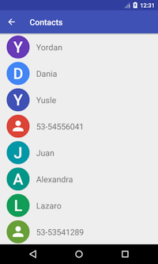
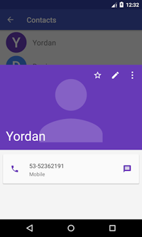

# Overview

[  ](https://bintray.com/ypdieguez/maven/material-contact-icon/_latestVersion)

This library is a wrapper of some classes from
[ContactsCommon](https://android.googlesource.com/platform/packages/apps/ContactsCommon/)
repository provided by [Android Open Source Project](https://source.android.com/).
These classes allow you to create the same contact icons that are shown in the
application [Contacts](https://android.googlesource.com/platform/packages/apps/Contacts/)
from api 21.




# Adding library
Add the following dependency to your `build.gradle` file:

  ```gradle  
    compile 'io.github.ypdieguez:material-contact-icon:1.0.0'
  ```

# How to use

These are the main classes for creating icons:

`ContactPhotoManager`: Asynchronously loads contact photos and maintains a cache
of photos.

`LetterTileDrawable`: A drawable that encapsulates all the functionality needed
to display a letter tile to represent a contact image.

It is recommended to use `ContactPhotoManager` to create and load the icons,
but if you want to manage this part on your own, you can use` LetterTileDrawable`
directly.

## Using `ContactPhotoManager`:

First create an instance of `ContactPhotoManager`.

``` java
ContactPhotoManager mPhotoManager = ContactPhotoManager.getInstance(this);
```

Then call the `loadPhoto` method.

``` java
mPhotoManager.loadPhoto(imageView, photoUri, requestedExtent, darkTheme, isCircular, defaultImageRequest);
```

Where:

`imageView`: The target view.

`photoUri`: The uri of the photo to load.

`requestedExtent`: Specifies an approximate Max(width, height) of the target view.
This is useful if the source image can be a lot bigger that the target, so that
the decoding is done using efficient sampling. If requestedExtent is specified,
no sampling of the image is performed.

`darkTheme`: Whether the background is dark. This is used for default avatars.

`isCircular`: Whether the icon is going to be round or square. **It does not work!**

`defaultImageRequest`: `DefaultImageRequest` object that specifies how a default
letter tile avatar should be drawn.

For the `defaultImageRequest` parameter, you must create the object as shown below:
``` java
DefaultImageRequest request = new DefaultImageRequest(displayName, identifier, isCircular);
```
Where:

`displayName`: The name of the contact.

`identifier`:  Contact identifier string. Based on this identifier is that a
deterministic color is returned. **To get the same color that the application
Contacts you must use the `Contacts.LOOKUP_KEY` attribute of the contacts
provider.**

`isCircular`: Whether the icon is going to be round or square. **It does work!**

## Using `LetterTileDrawable`

**Note:** If you use directly this class, in case that contact has a photo you must
implement your own class that create a round icon with the photo.

Use this class is as simple as the following snippet shows:

``` java
LetterTileDrawable drawable = new LetterTileDrawable(resources);
drawable.setLetterAndColorFromContactDetails(displayName, identifier);
drawable.setIsCircular(true);

imageView.setImageDrawable(drawable);
```

Where:

`resources`: The `Resources` object

`displayName`: The name of the contact.

`identifier`:  Contact identifier string. Based on this identifier is that a
deterministic color is returned. **To get the same color that the application Contacts you must use the `Contacts.LOOKUP_KEY` attribute of the contacts provider.**

If `drawable.setIsCircular(true);` is not called then the icon will be square.

### QickContactBadge

This widget extends from `ImageView`, so it can be passed as parameter to the `loadPhoto` method of  `ContactPhotoManager`; or it may be the target view to which the `LetterTileDrawable` object is passed to it.

So that the triangle is not displayed should call the method
`setOverlay(null)`. Anyway it is only possible to call from api
21, so I create a `MaterialQickContactBadge` widget that works for all android versions.

To use it in your layout:

``` xml
<io.github.ypdieguez.materialcontacticon.MaterialQuickContactBadge
    android:id="@+id/contact_icon_view"
    android:layout_width="56dp"
    android:layout_height="56dp"/>
```

# Final Note

To get a better understanding of how to use the library, you can see the example application inside this project.

# License

    Copyright (C) 2017 Yordan P. Dieguez <ypdieguez@tuta.io>

    Licensed under the Apache License, Version 2.0 (the "License");
    you may not use this file except in compliance with the License.
    You may obtain a copy of the License at

         http://www.apache.org/licenses/LICENSE-2.0

    Unless required by applicable law or agreed to in writing, software
    distributed under the License is distributed on an "AS IS" BASIS,
    WITHOUT WARRANTIES OR CONDITIONS OF ANY KIND, either express or implied.
    See the License for the specific language governing permissions and
    limitations under the License.
